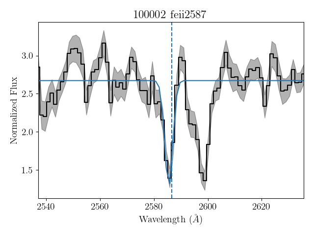

# Absorption Line Fitting Tool

A Python tool for fitting Gaussian profiles to absorption lines in astronomical spectra, mainly used to obtain the observed centroids of the lines.  
This works with any spectrum stored as a plain text file (`.txt`) containing wavelength, flux, and error columns.
The line fitting tool works best on single absorption lines and is not recommended for doublets (e.g., Mg II at $\lambda\lambda 2796, 2803 Å$).

---

## Overview

This program measures absorption lines in spectra using:
- Non-parametric flux integration for line detection
- Gaussian fitting to obtain centroids of absorption lines.
- Monte Carlo simulations to estimate uncertainties

All results are written to tab-separated `.txt` file.

---

## Features

- Works with any text-based spectra
- Fits multiple absorption lines automatically
- Outputs combined result table of all lines and galaxies

---

## Input Files

The script requires four inputs:

1. **Spectra Directory**  

   A folder containing one or more `.txt` files. Each file must have three columns.

   **Columns**:
    `wavelength flux error`

2. **Absorption Line List** (`linelist.txt`)

    Defines the rest wavelengths of the absorption lines and the continuum windows around each line. The list must have six columns.

    **Columns**:
    `linename lam0 blue-window1 blue-window2 red-window1 red-window2`

    **How to determine the windows**:
    
    1. Create a composite spectrum of all your available spectra.
    2. Inspect each absorption line in the composite spectrum.
    3. Define the blue (left) and red (right) wavelength windows by eye, making sure to avoid nearby lines.
    4. These windows will be used to calculate the local continuum of each line.

    **Example**
    ```python
    feii2374	2374.46	    2300	2330	2405	2425
    feii2600	2600.17	    2540	2560	2640	2660
    
3. **Redshift List**

    Provides the spectroscopic redshift value for each spectrum. The list should have two columns.

    **Columns**:
    `Object z`

4. **Output Directory**

    Folder where results will be saved. The code will not overwrite old files by appending the version number if needed.
## Constants
There are several constants that can be changed as needed. These constants (with associated default values) are:

- `SIM_NUM = 1000`: The number of simulated spectra used in Monte Carlo estimation of uncertainties.
- `EDGE = 35`: The interval width to check if the absorption line is in the spectrum (in angstroms)
- `GUESS = 10`: The allowed range around the expected line center where the fit searches for the Gaussian peak.
- `FLUX_MEAN_SIG = 4`: The significance threshold used to determine whether a line is considered detected.
- `FILE_NAME = 'absorption_fitting_results.txt'`: The file name where the results will be saved.

## Output

Results are saved in a tab-separated `.txt` file. The file contains the non-parametric flux and error, and the mean values and standard deviations of the Gaussian fit parameters from the realizations for each line. Any line with a non-detection has -9999 for each parameter. Specifically, these parameters are:

- `NonParametric_Flux`: the flux found from the area under the curve, used to determine if the line is significantly detected
- `Gaussian_Flux`: mean line flux found from the Gaussian curve fitting
- `a`: the Gaussian baseline offset
- `b`: the slope of the linear fit to the continuum
- `d`: the amplitude of the line profile
- `s`: the width of the line profile
- `mu`: the line centroid in the observed frame in units of Angstroms and in the rest frame of the object

## Optional Overplotting Feature

You can also chose to overplot the final fits. When enabled, a 'plots' folder will be created inside the 'results' directory. The plots show each individual fitted spectral line for each galaxy. The plots should the spectrum (black), the error spectrum (gray shaded region), the absorption line fit (blue line) and the rest wavelength of the line (blue dashed line).

**Example**



## Requirements

- Python 3.9+
- numpy
- pandas
- scipy
- matplotlib
  
## Installation
Clone the repository and install dependencies:

```bash
git clone https://github.com/ekehoe46/absorption-line-fitting-tool.git
cd absorption-line-fitting-tool
pip install -r requirements.txt
```

## Usage
 
Run the script from the command line, specifying the spectra directory, line list, redshift file, and output directory:

```bash
python absorption_line_fitting.py spectra/ linelist.txt redshifts.txt results/
```
If you would like to overplot your fits then run: 
```bash
python absorption_line_fitting.py spectra/ linelist.txt redshifts.txt results/ --overplot
```

## Example

To see how the absorption line fitting tool works, you can run it on the example data included in the `Example` folder. This folder contains:
- **Spectra** (`Example/spectra/`): sample `.txt` files with wavelength, flux, and error columns
- **Line list** (`Example/linelist.txt`): defines the absorptioni lines and continuum windows
- **Redshifts** (`Example/redshifts.txt`): redshift values and target spectra ID

There is also a `results` directory with a catalog of the parameters of the fits along with the overplotted fits in the `plots` directory. Running the script on the example will create a new catalog called `combined_absorption_results_v1.txt` and will overwrite the plots if you choose to run the overplotting feature.

To run the script with the example data:
```bash
python absorption_line_fitting.py Example/spectra/ Example/linelist.txt Example/redshifts.txt Example/results/
```

To generate overplot figures for each fitted line as well use:
```bash
python absorption_line_fitting.py Example/spectra/ Example/linelist.txt Example/redshifts.txt Example/results/ --overplot
```


